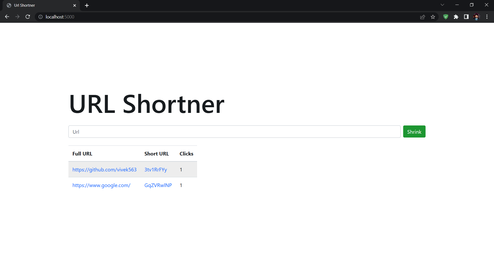

# URL Shortener Project

URL shortener project is a tool that shortens lengthy web addresses into concise and manageable links. The purpose of a URL shortener is to create a shorter, more memorable URL that can be easily shared and accessed, particularly on social media platforms where character limits are a concern. The project typically involves creating a web application or API that can generate a unique shortened URL for any given long URL and redirect users to the original webpage when the shortened URL is accessed. The project may also include additional features such as analytics, password protection, and custom branding options
 
 

* i have create this project using the following technologies:-
 
  - EJS
  - express js
  - mongodb
  
   
    

## Time taken to create this project
 * 3 hours
  
   
    
# Screenshot

